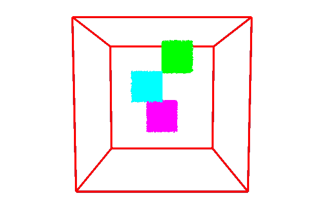
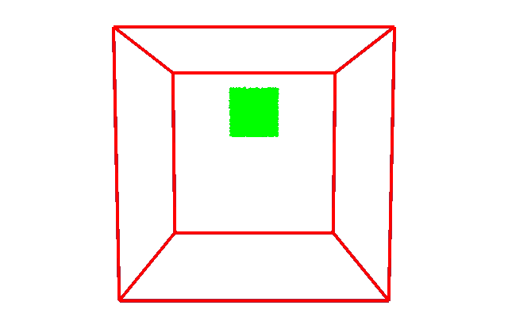
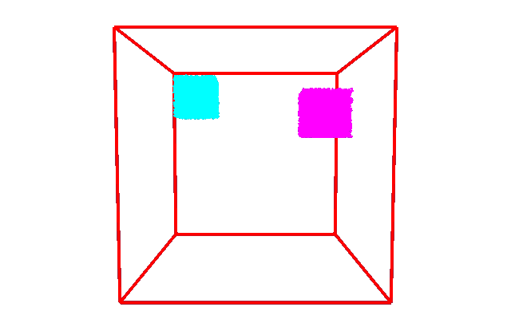

# splash
Splash is a Work-In-Progress physical simulation using the APIC Material Point Method. 

This program implements the material point method described in the [2016 SIGGRAPH Course Notes](https://www.seas.upenn.edu/~cffjiang/research/mpmcourse/mpmcourse.pdf) by Jiang  et al.
It also draws from details elaborated in [Stomakhin 2013](http://alexey.stomakhin.com/research/snow.html), [Jiang 2015](https://www.seas.upenn.edu/~cffjiang/research/apic/paper.pdf) and [Gast 2015](https://www.math.ucla.edu/~jteran/papers/GSSJT15.pdf)

The purpose of this project is to first learn the core principles of the Material Point Method. 
The second goal of this project is to learn and implement various parallel programming methods. 

Splash uses [libigl](https://libigl.github.io/) for rendering.

## 


## Features/TODO
* [x] Serial Explicit MPM
* [x] Serial Implicit MPM
* [x] OpenMP Explicit MPM
* [ ] OpenMP Implicit MPM
* [ ] MPI Implicit MPM

## Compiling
Dependencies
- [libigl](https://libigl.github.io/) and its dependencies (imgui, opengl)
- [lodepng](https://github.com/lvandeve/lodepng) (included)

If not installed, simply clone https://github.com/libigl/libigl into this project's lib/ folder
```
cd lib
git clone https://github.com/libigl/libigl.git
```

### Linux
```
mkdir build
cd build
cmake -DCMAKE_BUILD_TYPE=Release ..
make
```
I tested compiling with GCC 7.3 and ICC 19.0 on Ubuntu 18.

### Windows & MacOS
Untested. 

## Usage
From the binary directory (build/bin/)
```
./splash
```

## Demo

### Falling blocks
10,000 particles per block on 50x50x50 grid. Captured 1 in 15 simulation frames.


### Block thrown at wall
10,000 particles per block on 50x50x50 grid. Captured 1 in 10 simulation frames.


### Colliding blocks
10,000 particles per block on 50x50x50 grid. Captured 1 in 10 simulation frames.

